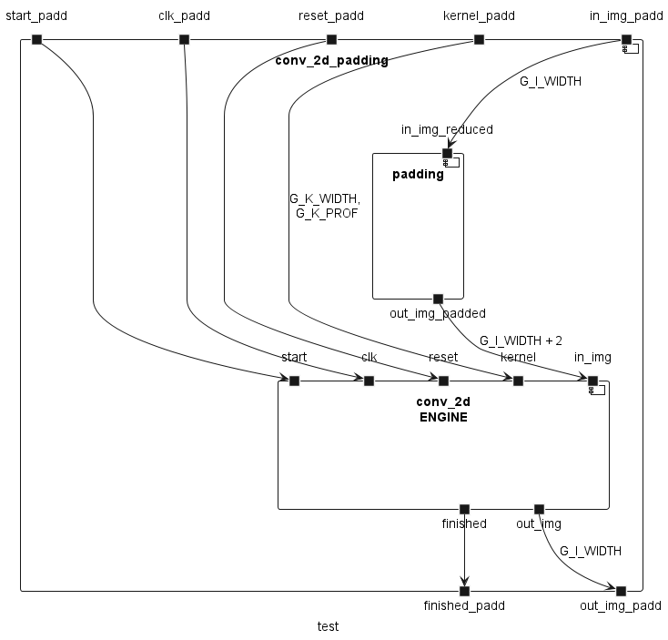
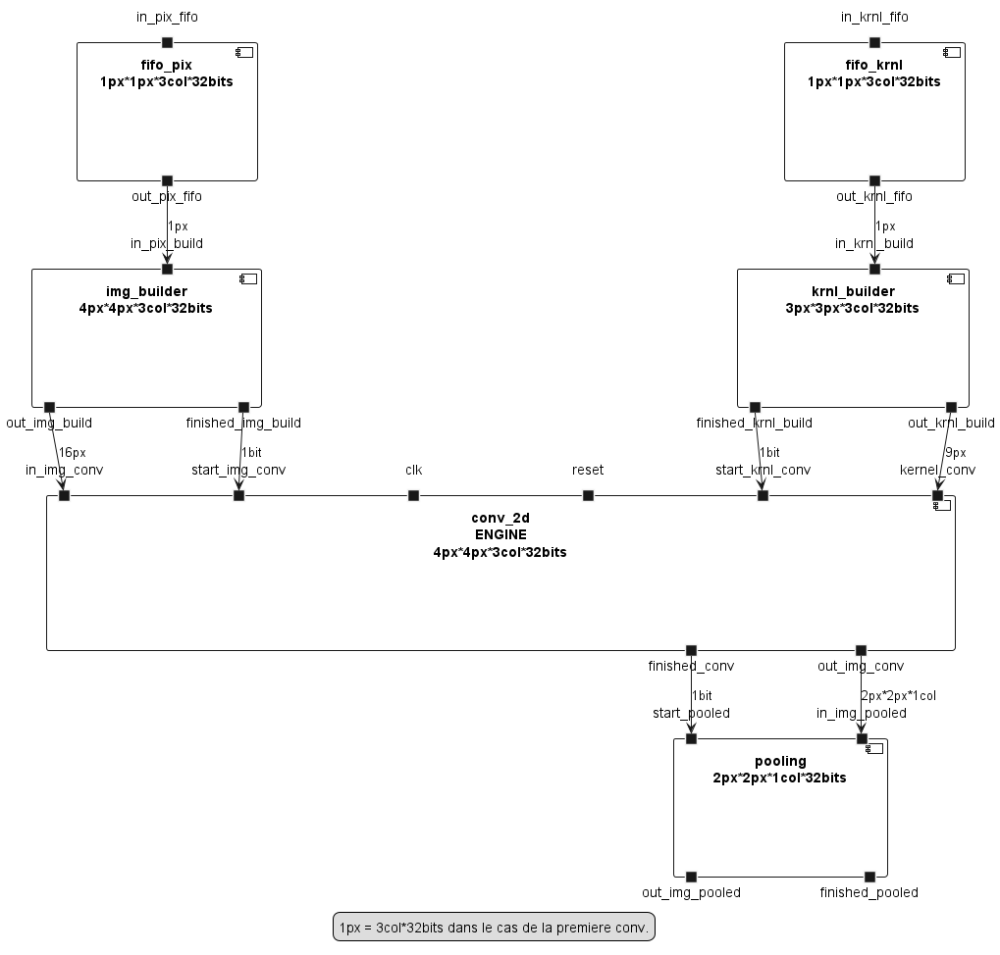

# FPGA part of project A-Eye
The idea is here to accelerate in hardware the longest operation. Currently, the convolution take about 60 percent of the processing time. That's why we start by accelerating the convolution steps.  
## Documentations
### Done
On the day of 22 June, we dispose of a convolution 2D engine, which is called with padding. Source code are in this git.  
  
### To do
The proposal for the meetings of 23 June is to load picture and kernel with fifo and builder, process the convolution in order to produce a 2 by 2 matrix, and apply pooling on it.  
  
## Troubleshooting
Vivado simulator is uncompatible with float32, even if float32 are part of IEEE and support in VHDL2008. To simulate, I choose to use questa, which has a version free of charge (starter edition). To do this, you will have to generate a free license of Intel license webpage.  