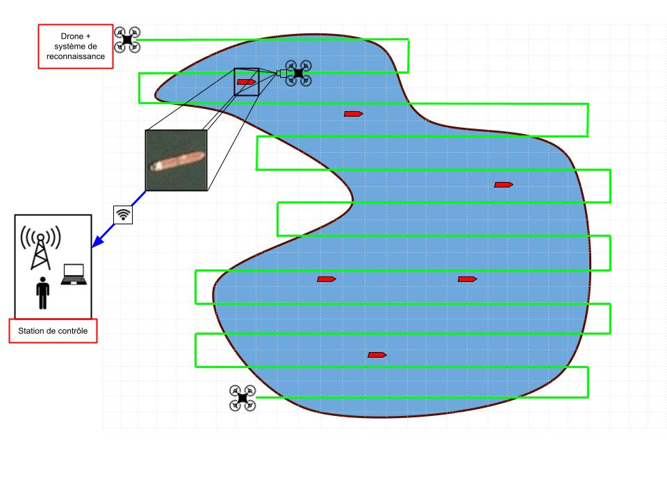

<!-- PROJECT LOGO -->
<p align="center">
  
</p>
<h3 align="center">A - EYE </h3>
<p align="center">
<em>An awesome project for embedded AI</em>
</p>
Developpers : Guilhem ROLLAND and Thomas DU BOISROUVRAY

This repository contains the documented source code for this project.

<!-- TABLE OF CONTENTS -->
<details>
  <summary>Table of Contents</summary>
  <ol>
    <li>
      <a href="#about-the-project">About The Project</a>
      <ul>
        <li><a href="#use-case">Use case</a></li>
        <li><a href="#application">Application</a></li>
        <li><a href="#built-with">Built With</a></li>
      </ul>
    </li>
    <li>
      <a href="#getting-started">Getting Started</a>
      <ul>
        <li><a href="#prerequisites">Prerequisites</a></li>
        <li><a href="#installation">Installation</a></li>
      </ul>
    </li>
    <li><a href="#usage">Usage</a></li>
    <li><a href="#roadmap">Roadmap</a></li>
    <li><a href="#contributing">Contributing</a></li>
    <li><a href="#license">License</a></li>
    <li><a href="#contact">Contact</a></li>
    <li><a href="#acknowledgments">Acknowledgments</a></li>
  </ol>
</details>

<!-- ABOUT THE PROJECT -->
## About The Project

The goal of the project was to build a system capable of sorting images with and without boats. 

### Use case


<div style="text-align: justify">  

The target for this system was a ZYNQ processor.
Our system is divided between an embedded sytem on ZYBO board and an application on a computer.
</div>

### Application


<div style="text-align: justify">
Here you can see the PC application which controls the embedded system. From there you can choose the mode between auto mode (processing images with AI) or manual mode (where you can take pictures manually).

Depending on the current mode, the application will show boat images (if you are in auto mode) or the latest image if you choose to manually take a picture. 
</div>

<p align="right">(<a href="#top">back to top</a>)</p>

### Built With

#### Hardware

This project was developped for ZYNQ target. We used the [ZYBO Z7](https://digilent.com/reference/programmable-logic/zybo-z7/start) board on petalinux for developpment.

A convolution IP was developped using VHDL for hardware acceleration.

#### Software
  
- [Tensorflow](https://www.tensorflow.org/) : lib for high-level AI
- [Colab](https://colab.research.google.com/) : Cloud plateform which provides GPU for AI training
- [Cdeotte C CNN implementation](https://github.com/cdeotte/MNIST-CNN-99.5)
- TCP & [MQTT](https://www.eclipse.org/paho/index.php?page=clients/python/index.php) : communication
- C, C# and Python for software developpement
- [Gherkin](https://cucumber.io/docs/gherkin/) : test automatisation
- [CMake](https://cmake.org/) : compiling and building the project
- [Doxygen](https://doxygen.nl/) : documentation of the project
- [.NET6](https://docs.microsoft.com/fr-fr/dotnet/core/whats-new/dotnet-6) : Framework used for A-Eye_Controller

<p align="right">(<a href="#top">back to top</a>)</p>

## Getting Started

### Prerequisites 

Before anything, you need to build the petalinux for your board. Run the following commands :
```bash
petalinux-create -t project --template zynq -n petaFromVivado # Create the workspace   
petalinux-config --get-hw-description # Load HDF file   
petalinux-config # Enter global configuration    
petalinux-config -c rootfs # Enter rootfs configuration   
petalinux-build # produce image.ub, system.dtb and rootfs files   
petalinux-package --boot --force --fsbl images/linux/zynq_fsbl.elf --fpga images/linux/*_wrapper.bit --u-boot # produce BOOT.BIN    
```
Once you have a fully functionnal petalinux on the board you may run the installation steps.

### Installation

1. connect to the board using SSH and open a bash terminal
```bash
git clone https://github.com/GuilhemROLLAND/A-Eye.git #clone the repository
```
If the board isn't connected to internet, you clone the repository locally and transfer it to the board via SSH (using winSCP or else)

2. Using winSCP, you can also put the [example dataset](https://drive.google.com/uc?export=download&id=1odGQm0w5xhjG1suTzqstuRMIkoTY4mYx)  on the board.

3. Build the embedded project. From your working directory :
```bash
cd A_Eye/A_Eye_root/
CMake build #to do
CMake install
```
4. Build the application : (on your Windows computer)

**TO DO**
```bash
git clone https://github.com/GuilhemROLLAND/A-Eye.git #clone the repository
cd A-Eye/A-Eye_Controller/


