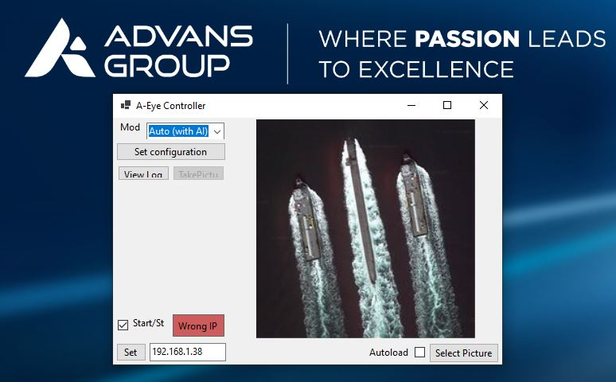

<!-- PROJECT LOGO -->
<p align="center">
  
</p>
<h3 align="center">A - EYE </h3>
<p align="center">
<em>An awesome project for embedded AI</em>
</p>
Developpers : Guilhem ROLLAND and Thomas DU BOISROUVRAY

This repository contains the documented source code for this project.

<!-- TABLE OF CONTENTS -->
<details>
  <summary>Table of Contents</summary>
  <ol>
    <li>
      <a href="#about-the-project">About The Project</a>
      <ul>
        <li><a href="#use-case">Use case</a></li>
        <li><a href="#application">Application</a></li>
        <li><a href="#built-with">Built With</a></li>
      </ul>
    </li>
    <li>
      <a href="#getting-started">Getting Started</a>
      <ul>
        <li><a href="#prerequisites">Prerequisites</a></li>
        <li><a href="#installation">Installation</a></li>
      </ul>
    </li>
    <li><a href="#usage">Usage</a></li>
    <li><a href="#roadmap">Roadmap</a></li>
    <li><a href="#contributing">Contributing</a></li>
    <li><a href="#license">License</a></li>
    <li><a href="#contact">Contact</a></li>
    <li><a href="#acknowledgments">Acknowledgments</a></li>
  </ol>
</details>

<!-- ABOUT THE PROJECT -->
## About The Project

The goal of the project was to build a system capable of sorting images with and without boats. 

### Use case


<div style="text-align: justify">  

The target for this system was a ZYNQ processor.
Our system is divided between an embedded sytem on ZYBO board and an application on a computer.
</div>

### Application




<div style="text-align: justify">
Here you can see the A-Eye Controller app (on windows PC) which controls the embedded system. From there you can choose the mode between auto mode (processing images with AI) or manual mode (where you can take pictures manually).

Depending on the current mode, the application will show boat images (if you are in auto mode) or the latest image if you choose to manually take a picture. 
</div>

<p align="right">(<a href="#top">back to top</a>)</p>

### Built With

#### Hardware

This project was firstly developped for ZYNQ target, and then the system was migrated to a Kria SOM. We used the [ZYBO Z7](https://digilent.com/reference/programmable-logic/zybo-z7/start) board on petalinux for developpment. For the Kria, we are based on a [KV260](https://www.xilinx.com/products/som/kria/kv260-vision-starter-kit.html).

A convolution IP is developped using VHDL for hardware acceleration.

#### Software
  
- [Tensorflow](https://www.tensorflow.org/) : lib for high-level AI
- [Colab](https://colab.research.google.com/) : Cloud plateform which provides GPU for AI training
- [Cdeotte C CNN implementation](https://github.com/cdeotte/MNIST-CNN-99.5)
- TCP & [MQTT](https://www.eclipse.org/paho/index.php?page=clients/python/index.php) : communication
- C, C# and Python for software developpement
- [Gherkin](https://cucumber.io/docs/gherkin/) : test automatisation
- [CMake](https://cmake.org/) : compiling and building the project
- [Doxygen](https://doxygen.nl/) : documentation of the project
- [.NET6](https://docs.microsoft.com/fr-fr/dotnet/core/whats-new/dotnet-6) : Framework used for A-Eye_Controller
- [Jenkins](https://www.jenkins.io/) : continuous integration and test driven developpment

<p align="right">(<a href="#top">back to top</a>)</p>

## Generate documentation of the code

To generate html webpages about source code documentation, we advise you to use [Doxygen](https://doxygen.nl/) and load in the doxywizard the doxyfile located in the root folder of the project. You will then find index.html in the generated folder "doc".


## Getting Started

### Prerequisites 

Before anything, you need to set up your board. This can be done by creating and flashing a petalinux, or on the Kria, by using the [Ubuntu](https://ubuntu.com/download/amd-xilinx) provided.

For petalinux, please refer to this [user guide](https://docs.xilinx.com/r/en-US/ug1144-petalinux-tools-reference-guide). Here are the most important commands :

```bash
petalinux-create -t project --template zynq -n petaFromVivado # Create the workspace   
petalinux-config --get-hw-description # Load HDF file, it must be copy there before !!!   
petalinux-config # Enter global configuration    
petalinux-config -c rootfs # Enter rootfs configuration   
petalinux-build # produce image.ub, system.dtb and rootfs files   
petalinux-package --boot --force --fsbl images/linux/zynq_fsbl.elf --fpga images/linux/*_wrapper.bit --u-boot # produce BOOT.BIN    
```

Then, partitionned the SD card and copy the file as mentionned in the user guide above.   
Once you have a fully functionnal petalinux on the board, you may run the installation.

### Install and run the A-Eye app

1. Connect to the board using SSH and open a bash terminal
```bash
git clone https://github.com/GuilhemROLLAND/A-Eye.git #clone the repository
```
If the board isn't connected to internet, you can clone the repository locally and transfer it to the board using SSH (with winSCP or whatever you want).  

2. Then, you have to put the [dataset](https://drive.google.com/uc?export=download&id=1odGQm0w5xhjG1suTzqstuRMIkoTY4mYx) on the board. This must be unzip and place in folder A-Eye, root of the project.  

3. Build the embedded project. From your working directory :
```bash
cd A_Eye/A_Eye_root/
./restart
```

4. Once the embedded part is running, you can interract with using A-Eye_Controller. 
  
4.1. Using Visual Studio : You have to get Visual studio for c# (winforms, .net6). Then, run the .sln in A-Eye_Controller folder. 
You can easily build the application and use it !

4.2. TODO Using the installer : Run the installer and launch the app !


